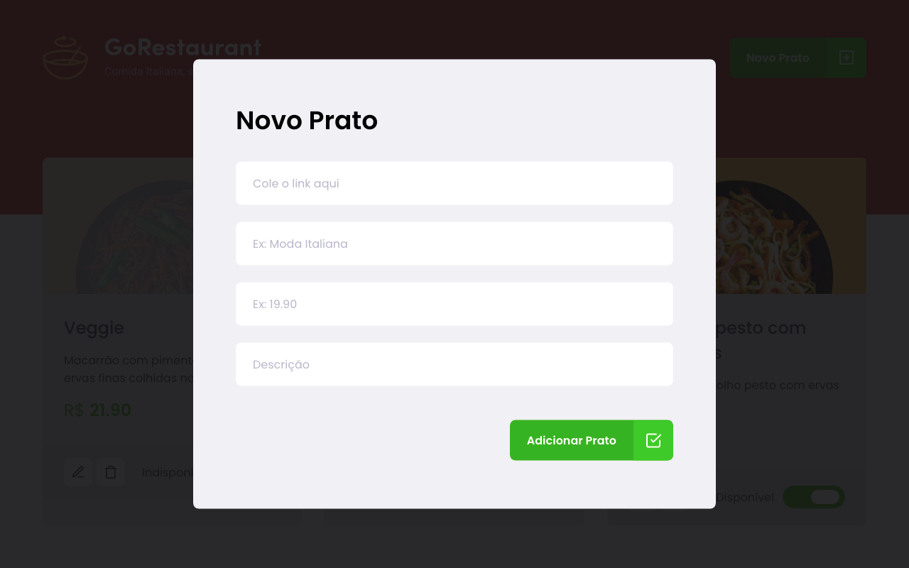

<h1>🚀 GoRestaurant-Web-Bootcamp-GoStack-Rocketseat-Desafio-10</h1>

In this challenge proposed by Rocketseat's Bootcamp I developed an application called GoRestaurant.
In his implementation I was able to practice what I have learned so far in React.js along with TypeScript, using the concept of CRUD (Create, Read, Update, Delete).
  
This application connects to a fake API, displays food dishes and allows the creation, removal and updating of these dishes.

