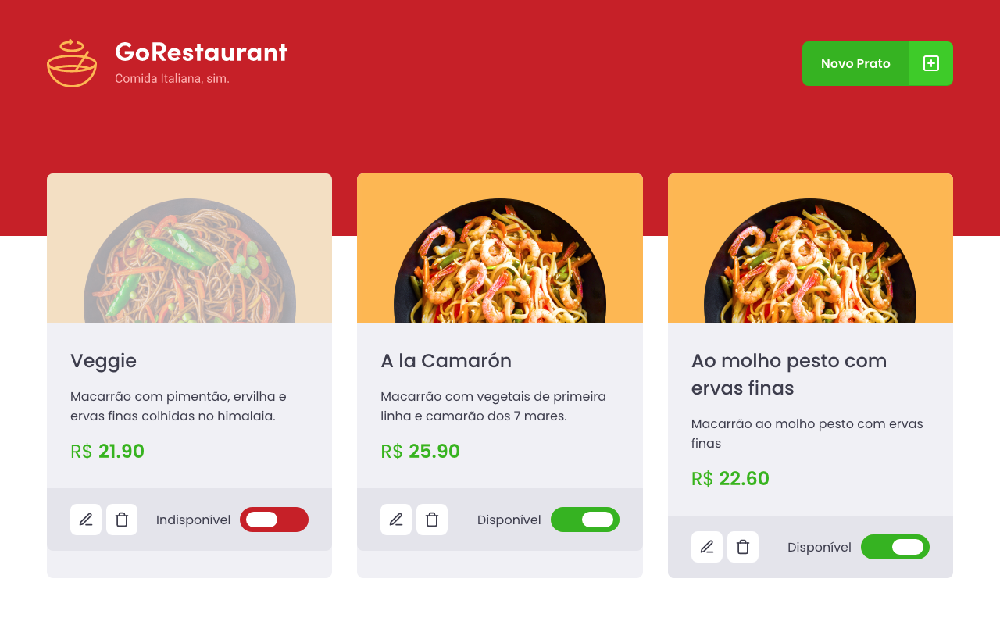

<h1>🚀 GoRestaurant Web</h1>

<h3>Web Owner Version:</h3>

In this challenge proposed by Rocketseat's Bootcamp I developed an application called GoRestaurant.
In his implementation I was able to practice what I have learned so far in React.js along with TypeScript, using the concept of CRUD (Create, Read, Update, Delete).
    
This application is a version intended for the owner of the establishment. It connects to a fake API, displays food dishes and allows the creation, removal and updating of these dishes.

Mobile Client Version: https://github.com/tialaR/GoRestaurant-Mobile-Bootcamp-GoStack-Rocketseat-Desafio-11

