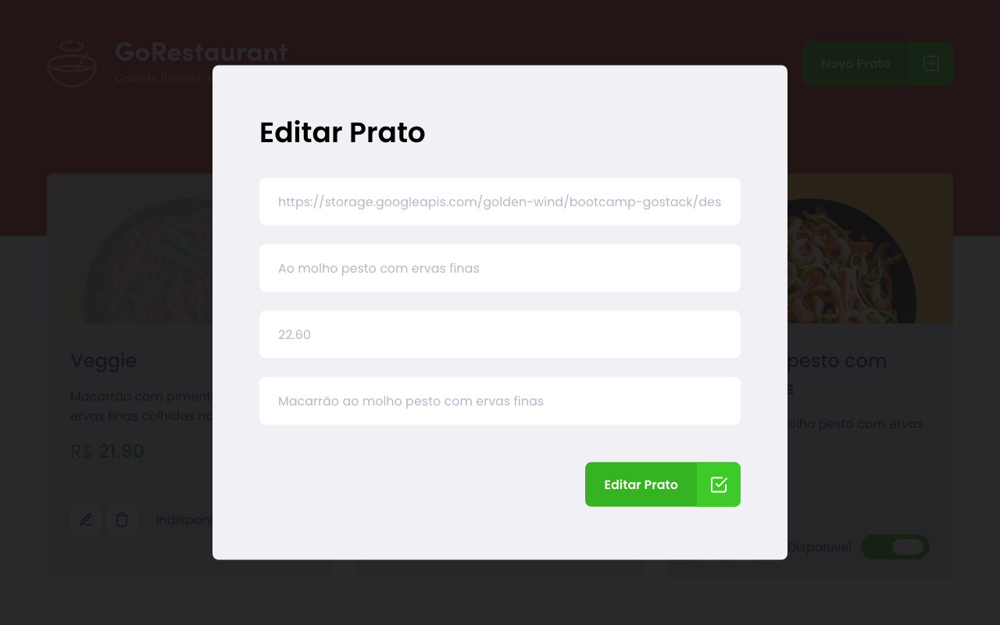

# GoRestaurant-Web-Bootcamp-GoStack-Rocketseat-Desafio-10

Nesse desafio proposto pela Bootcamp da Rocketseat desenvolvi uma aplicação chamada GoRestaurant. Na implementação dele pude implementar o que aprendi até agora no React.js junto com TypeScript, praticando o conceito de CRUD (Create, Read, Update, Delete).

Essa aplicação se conecta a uma fake API, exibe pratos de comida e permite a criação, remoção e atualização desses pratos.

